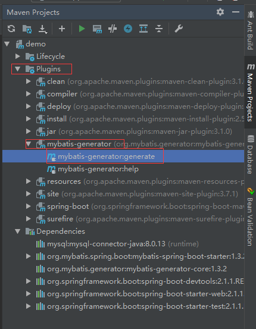
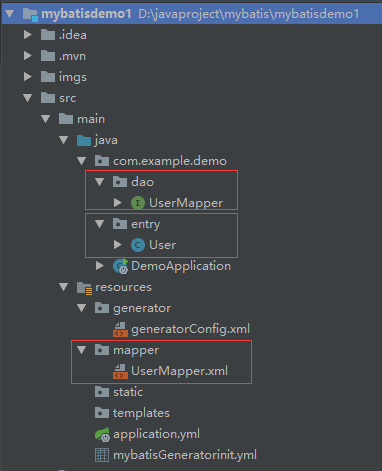
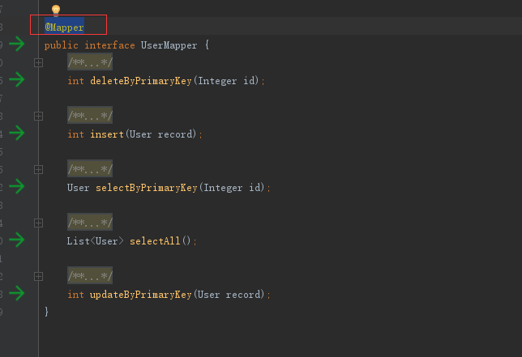
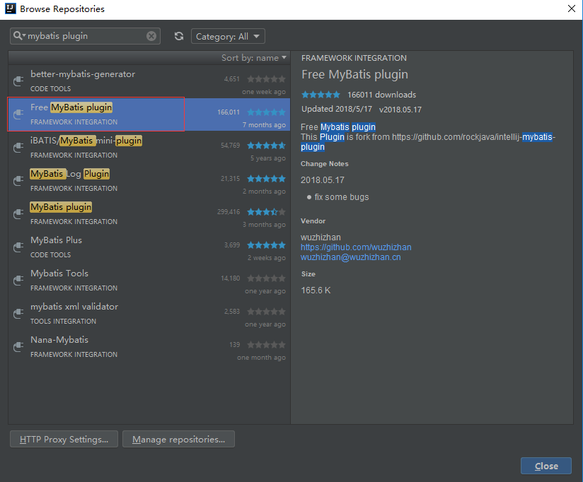
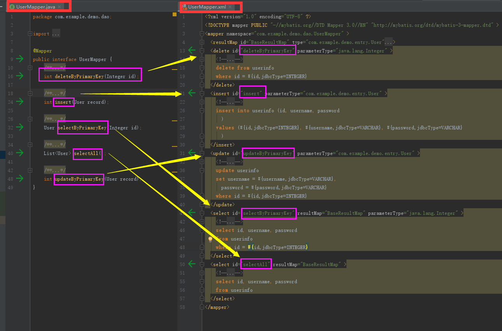

#  pom.xml 依赖

``` 
<!--mysql-->
<dependency>
    <groupId>mysql</groupId>
    <artifactId>mysql-connector-java</artifactId>
    <scope>runtime</scope>
</dependency>

<!--mybatis-->
<dependency>
    <groupId>org.mybatis.spring.boot</groupId>
    <artifactId>mybatis-spring-boot-starter</artifactId>
    <version>1.3.2</version>
</dependency>

<!--mybatis-generator-->
<dependency>
    <groupId>org.mybatis.generator</groupId>
    <artifactId>mybatis-generator-core</artifactId>
    <version>1.3.2</version>
</dependency>

<!--  -->

<!-- mybatis generator 配置 -->
<plugin>
    <groupId>org.mybatis.generator</groupId>
    <artifactId>mybatis-generator-maven-plugin</artifactId>
    <configuration>
        <!-- 自动生成的配置 -->
        <configurationFile>src/main/resources/generator/generatorConfig.xml</configurationFile>
        <!--允许移动生成的文件 -->
        <verbose>true</verbose>
        <!-- 是否覆盖 -->
        <overwrite>true</overwrite>
    </configuration>
</plugin>
```
注意：plugin部分配置了generator配置文件的路径

# 建立数据库

``` 
DROP TABLE IF EXISTS `userinfo`;
CREATE TABLE `userinfo` (
  `id` int(11) NOT NULL AUTO_INCREMENT,
  `username` varchar(255) DEFAULT NULL,
  `password` varchar(255) DEFAULT NULL,
  PRIMARY KEY (`id`)
) ENGINE=MyISAM AUTO_INCREMENT=19 DEFAULT CHARSET=utf8;

-- ----------------------------
-- Records of userinfo
-- ----------------------------
INSERT INTO `userinfo` VALUES ('1', '刘诗诗', '12345');
INSERT INTO `userinfo` VALUES ('2', '吴奇隆', '54321');
INSERT INTO `userinfo` VALUES ('3', '小吴奇隆', '66666');
INSERT INTO `userinfo` VALUES ('4', '葫芦岛吴奇隆', '99999');
INSERT INTO `userinfo` VALUES ('18', '赵2敏', 'eeeeee');

```

# 创建generator配置文件

数据库配置文件：

resources/application.properties:

``` 
# database
spring.datasource.url=jdbc:mysql://127.0.0.1:3306/mydb?useUnicode=true&characterEncoding=utf8&useSSL=false&serverTimezone=GMT
spring.datasource.username=root
spring.datasource.password=admin
spring.datasource.driver-class-name=com.mysql.cj.jdbc.Driver
# mapper
mybatis.mapper-locations=classpath:mapper/*.xml

```

generator配置文件：

resources/generator/generatorConfig.xml：

``` 
<?xml version="1.0" encoding="UTF-8"?><!DOCTYPE generatorConfiguration
        PUBLIC "-//mybatis.org//DTD MyBatis Generator Configuration 1.0//EN"
        "http://mybatis.org/dtd/mybatis-generator-config_1_0.dtd">
<generatorConfiguration>

    <!-- 引入配置文件 -->
    <properties resource="application.properties"/>

    <!-- 数据库驱动:换成你本地的驱动包位置-->
    <classPathEntry
            location="C:\Users\13579\.m2\repository\mysql\mysql-connector-java\8.0.13\mysql-connector-java-8.0.13.jar"/>

    <context id="mysql" defaultModelType="hierarchical" targetRuntime="MyBatis3Simple">
        <!-- 注释 -->
        <commentGenerator>
            <property name="suppressAllComments" value="false"/><!-- 是否取消注释 -->
            <property name="suppressDate" value="true"/> <!-- 是否生成注释代时间戳-->
        </commentGenerator>

        <!--1.数据库连接的信息：驱动类、连接地址、用户名、密码  -->
        <!--数据库链接URL，用户名、密码 -->
        <jdbcConnection driverClass="${spring.datasource.driver-class-name}"
                        connectionURL="${spring.datasource.url}"
                        userId="${spring.datasource.username}"
                        password="${spring.datasource.password}">
        </jdbcConnection>
        <!--1.如果是其他数据库，只要改driverClass 和connectionURL就可以了-->
        <!-- <jdbcConnection driverClass="oracle.jdbc.OracleDriver"
            connectionURL="jdbc:oracle:thin:@127.0.0.1:1521:yycg"
            userId="yycg"
            password="yycg">
        </jdbcConnection> -->

        <!-- 2.默认false，把JDBC DECIMAL 和 NUMERIC 类型解析为 Integer，为 true时把JDBC DECIMAL 和
            NUMERIC 类型解析为java.math.BigDecimal -->
        <!-- 类型转换 -->
        <javaTypeResolver>
            <!-- 是否使用bigDecimal， false可自动转化以下类型（Long, Integer, Short, etc.） -->
            <property name="forceBigDecimals" value="false"/>
        </javaTypeResolver>

        <!-- 3.targetProject:生成PO类的位置 -->
        <!-- 生成实体类地址 -->
        <javaModelGenerator targetPackage="com.example.demo.entry" targetProject="src/main/java">
            <!-- enableSubPackages:是否让schema作为包的后缀 -->
            <property name="enableSubPackages" value="false"/>
            <!-- 从数据库返回的值被清理前后的空格 -->
            <property name="trimStrings" value="true"/>
        </javaModelGenerator>

        <!-- 4.targetProject:mapper映射文件生成的位置 -->
        <!--mapper.xml-->
        <sqlMapGenerator targetPackage="resources.mapper" targetProject="src/main">
            <property name="enableSubPackages" value="false"/>
        </sqlMapGenerator>

        <!-- 5.targetPackage：mapper接口生成的位置 -->
        <!--mapper/dao-->
        <javaClientGenerator type="XMLMAPPER" targetPackage="com.example.demo.dao" targetProject="src/main/java">
            <property name="enableSubPackages" value="false"/>
        </javaClientGenerator>

        <!-- 6.指定数据库表,tableName就是数据库的表名,domainObjectName就是pojo类的名称，
        设置为User 则会生产 User.java,UserMapper.java,UserMapper.xml 的文件
         这里下面几个方法要设为false，不然会多生产Example 类和相应方法，这里目前用不到，默认是true，所以设置为false-->
        <table tableName="userinfo" domainObjectName="User"
               enableCountByExample="false" enableUpdateByExample="false"
               enableDeleteByExample="false" enableSelectByExample="false"
               selectByExampleQueryId="false"/>

    </context>
</generatorConfiguration>

```
注意：

> 修改数据库驱动的路径

> 修改数据库配置的路径等

> 修改数据库的tableName等

# 点击maven的plugins里面的mybatis-generator即可自动生成相关的文件：



生成的文件目录如下：



生成的mapper类默认生成五个基本方法：
``` 
public interface UserMapper {
    int deleteByPrimaryKey(Integer id);
    int insert(User record);
    User selectByPrimaryKey(Integer id);
    List<User> selectAll();
    int updateByPrimaryKey(User record);
}
```

# 测试

在UserMapper类上添加@Mapper注解，如图：



或者在启动类添加@MapperScan("mapper所在包的包名")
``` 
@MapperScan("com.example.demo.dao")
@SpringBootApplication
public class DemoApplication {

    public static void main(String[] args) {
        SpringApplication.run(DemoApplication.class, args);
    }

}
```

然后在测试类中添加测试代码：

``` 
@Autowired
UserMapper userMapper;

@Test
public void get() {
    User users = userMapper.selectByPrimaryKey(3);
    System.out.println("getUsername========" + users.getUsername());
    System.out.println("getPassword========" + users.getPassword());
}
```

打印如下：
``` 
getUsername========小吴奇隆
getPassword========66666
```

# mybatis plugin的使用

安装插件



使用此插件可方便在dao层与xml互相映射，点击绿色按钮即可。




# 报错

### 问题一：

```
[ERROR] Error resolving version for plugin 'org.mybatis.generator:mybatis-generator-maven-plugin' from the repositories [local (C:\Users\13579\.m2\repository), 

central (https://repo.maven.apache.org/maven2)]:

Plugin not found in any plugin repository -> [Help 1]
```

```
[ERROR] Failed to execute goal org.mybatis.generator:mybatis-generator-maven-plugin:1.3.2:
generate (default-cli) on project demo: 
Execution default-cli of goal org.mybatis.generator:mybatis-generator-maven-plugin:1.3.2:
generate failed: Exception getting JDBC Driver: ${spring.datasource.driver-class-name} -> [Help 1]
```
```
[ERROR] Failed to execute goal org.mybatis.generator:mybatis-generator-maven-plugin:1.3.2:
generate (Generate MyBatis Artifacts) on project demo: 
Unknown system variable 'query_cache_size' -> [Help 1]
```
```
[ERROR] Failed to execute goal org.mybatis.generator:mybatis-generator-maven-plugin:1.3.2:
generate (default-cli) on project demo: 
Execution default-cli of goal org.mybatis.generator:mybatis-generator-maven-plugin:1.3.2:
generate failed: Plugin org.mybatis.generator:mybatis-generator-maven-plugin:1.3.2 or one of its dependencies could not be resolved: 
Failed to collect dependencies at org.mybatis.generator:mybatis-generator-maven-plugin:jar:1.3.2 -> 
mysql:mysql-connector-java:jar:8.0.13 -> com.google.protobuf:protobuf-java:jar:3.6.1: 
Failed to read artifact descriptor for com.google.protobuf:protobuf-java:jar:3.6.1: 
Could not transfer artifact com.google.protobuf:protobuf-java:pom:3.6.1 from/to central (https://repo.maven.apache.org/maven2): 
Connect to repo.maven.apache.org:443 [repo.maven.apache.org/151.101.52.215] failed: Connection timed out: connect -> [Help 1]
```


解决：pom.xml中添加
```
<repositories>
	<repository>
		<id>maven-repo</id>
		<url>http://repo1.maven.org/maven2/</url>
	</repository>
	<repository>
		<id>mvnrepository</id>
		<url>http://mvnrepository.com/artifact/</url>
	</repository>
</repositories>

<pluginRepositories>
	<pluginRepository>
		<id>maven-repo</id>
		<url>http://repo1.maven.org/maven2/</url>
	</pluginRepository>
	<pluginRepository>
		<id>mvnrepository</id>
		<url>http://mvnrepository.com/artifact/</url>
	</pluginRepository>
</pluginRepositories>
```

### 问题二：

```
org.springframework.beans.factory.UnsatisfiedDependencyException: 
Error creating bean with name 'com.example.demo.DemoApplicationTests': 
Unsatisfied dependency expressed through field 'userMapper'; 
nested exception is org.springframework.beans.factory.NoSuchBeanDefinitionException:
 No qualifying bean of type 'com.example.demo.dao.UserMapper' available: 
 expected at least 1 bean which qualifies as autowire candidate. Dependency annotations: 
 {@org.springframework.beans.factory.annotation.Autowired(required=true)}
```

解决：在mapper类添加@mapper或者启动类添加mapperscan


